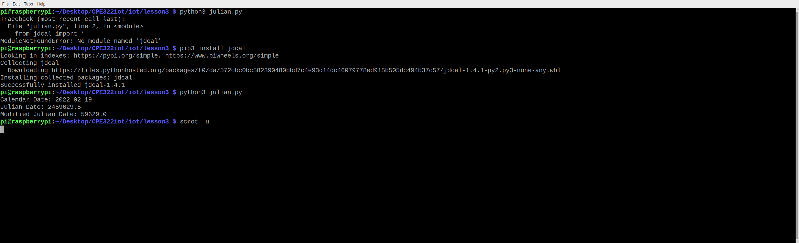
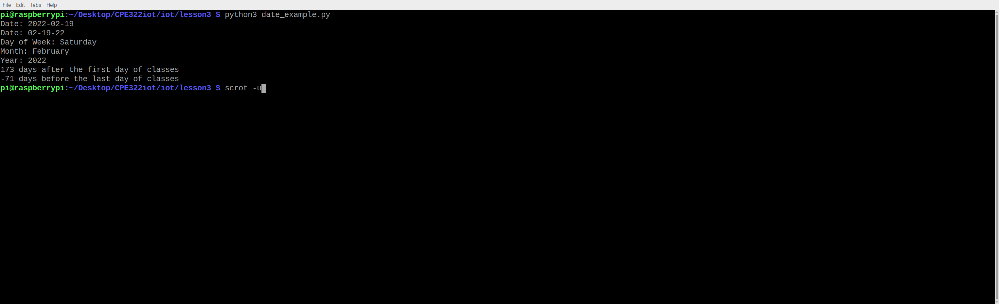
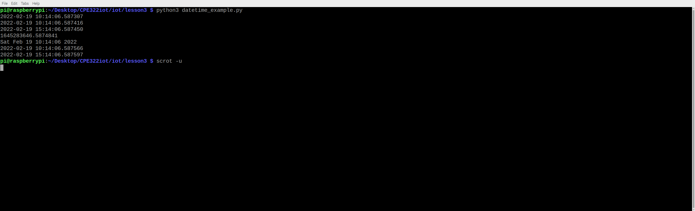
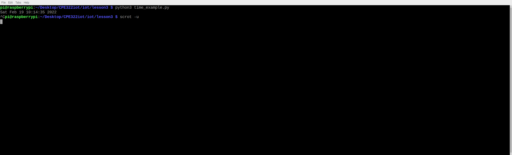
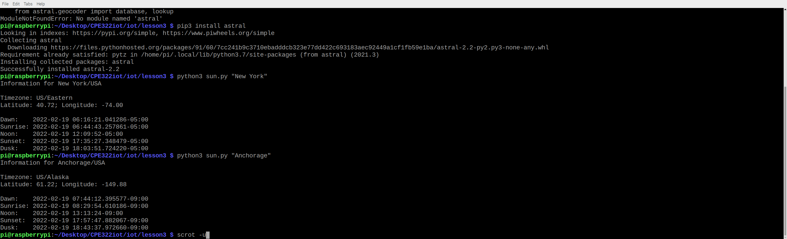
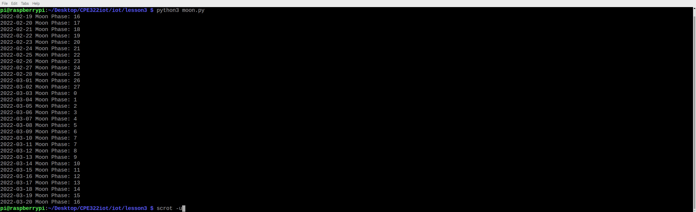
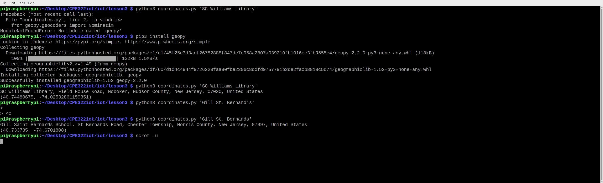
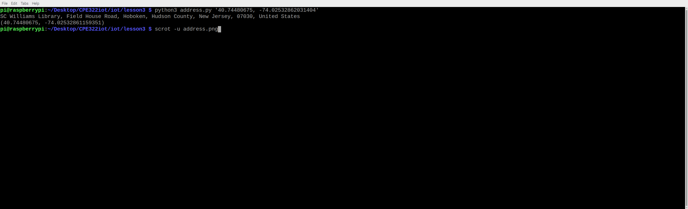
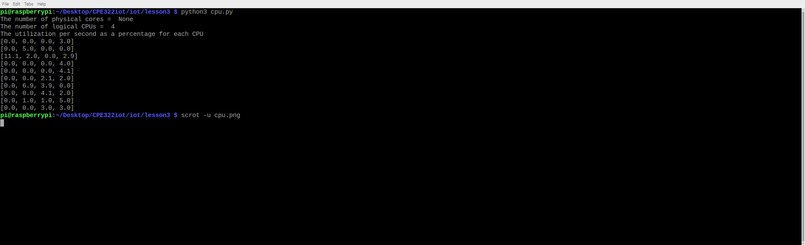

### Assignment  

## Test Different Python3 Files  

**julian**  
  

**date_example**  
  

**datetime_example**  
  

**time_example**  
  

**sun**  
  

**moon**  
  

**coordinates**  
  

**address**  
  

**cpu**  
  

**battery**  
  

**document_stats**  
  

### Done! :)
