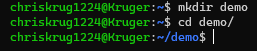

### Assignment  
  

**hostname**  
  

**env**  
  

**ps**  
  

**pwd**  
  

**clone**  
  

**cd iot, ls, cd**  
  

**df**  
  

**mkdir, cd**  
  

**nano**  
  

**cat**  
  

**cp, mv, rm**  
  

**clear**  
  

**man**  
  

**uname**  
  

**ifconfig**  
  

**ping**  
  

**netstat**  
  

### Done! :)
